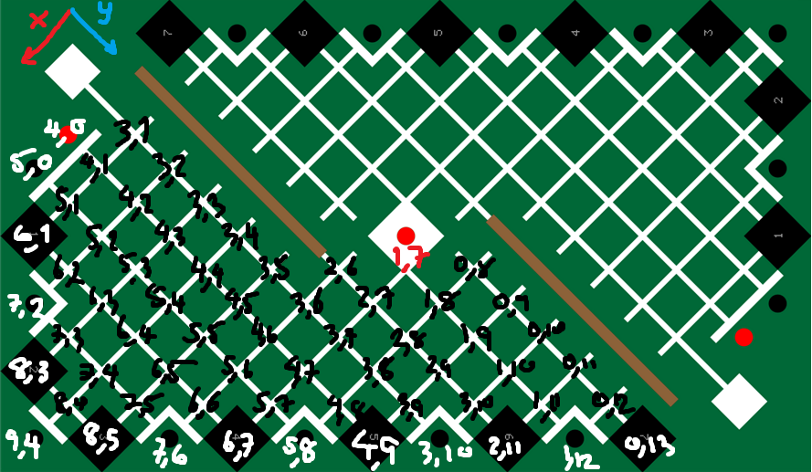
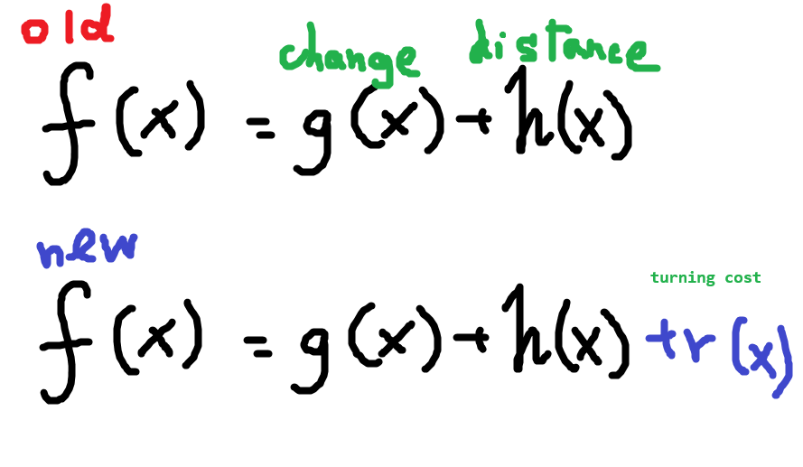
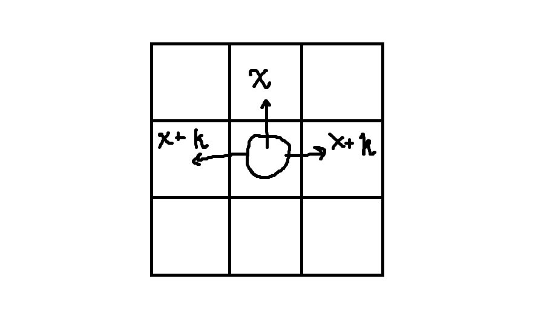

# MakerRoboticsAStar
 A* pathfinding for Maker Robotics Competition

## The Map

## A* modifications
We added a `r(n)` which is a turning factor

Which adds a cost `k` (this case is `10`), If the direction changes.
